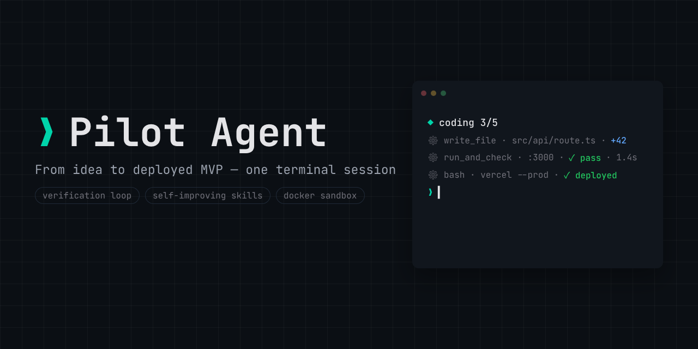

# Pilot Agent

CLI agent: from idea to deployed MVP in one guided terminal session.



[](https://github.com/Hqzdev/pilot-agent/actions/workflows/ci.yml)
[](LICENSE)
[](pyproject.toml)
[](https://github.com/astral-sh/ruff)

Pilot Agent runs discovery, planning, coding, acceptance, deployment, and launch
copy in one local CLI. It keeps project state in `.pilot-agent/STATE.md`,
writes complete tool outputs to `.pilot-agent/artifacts/`, and does not mark
work complete until verification has run.

`pilot-agent` is the CLI command.

## Capabilities

| Feature | Description |
|---|---|
| Provider-agnostic | Switch models mid-session with `/model` while preserving canonical history. |
| Three-tier context | Truncation, summarization, and externalized `STATE.md` keep long sessions usable. |
| Self-improving | Lessons and learned skills are stored as inspectable markdown. |
| Sandboxed | Agent-owned shell commands can run in Docker instead of directly on your machine. |
| Verification loop | The agent runs checks, reads failures, and keeps fixing until acceptance passes. |
| Human setup | `setup` stores keys in `~/.pilot-agent/credentials.yaml`; env vars are optional overrides. |

## Quick Install

Linux, macOS, and WSL2:

```bash
curl -fsSL https://raw.githubusercontent.com/Hqzdev/pilot-agent/main/install.sh | bash
```

Prefer to inspect first? Download `install.sh`, read it, run it.

<details><summary>Windows</summary>

Native Windows support is planned after v1. Use WSL2 today and run the Linux
command above inside the WSL shell.

</details>

<details><summary>Manual uv install</summary>

```bash
uv tool install git+https://github.com/Hqzdev/pilot-agent
```

</details>

## Getting Started

```bash
pilot-agent setup                  # provider, key, model, optional Vercel token
cd your-project
pilot-agent init                   # create .pilot-agent/STATE.md
pilot-agent doctor                 # diagnose config, credentials, tools, project
pilot-agent run                    # start or continue the pipeline
pilot-agent status                 # phase, TODO progress, turns, token count
```

## CLI Reference

| Area | Command | Purpose |
|---|---|---|
| Setup | `pilot-agent setup` | First-run wizard. |
| Setup | `pilot-agent setup --provider anthropic` | Skip provider selection. |
| Setup | `pilot-agent setup --reconfigure` | Re-run wizard using current values as defaults. |
| Auth | `pilot-agent auth set <provider>` | Prompt for and store a key in `credentials.yaml`. |
| Auth | `pilot-agent auth status` | Show configured services, source, and masked keys. |
| Auth | `pilot-agent auth remove <provider>` | Remove a stored key. |
| Health | `pilot-agent doctor [--json]` | Run environment, config, provider, tool, memory, and project checks. |
| Health | `pilot-agent update` | Update docker or native install. |
| Health | `pilot-agent version` | Version, commit, Python, platform. |
| Model | `pilot-agent model` | Interactive provider/model selection in a TTY. |
| Model | `pilot-agent model <provider>:<model>` | Switch directly, for example `openrouter:qwen/qwen3-coder`. |
| Model | `pilot-agent model --list` | List models for the current provider. |
| Config | `pilot-agent config` | Show effective config with source per key. |
| Config | `pilot-agent config set <key> <value>` | Edit with dot notation and validation. |
| Config | `pilot-agent config get <key>` | Print one value. |
| Config | `pilot-agent config edit` | Open the user config in `$EDITOR`. |
| Config | `pilot-agent config path` | Print the user config path. |
| Work | `pilot-agent init [path]` | Initialize project state. |
| Work | `pilot-agent run` | Start or continue the pipeline. |
| Work | `pilot-agent resume` | Resume from `session.jsonl`. |
| Work | `pilot-agent status` | Show phase, progress, turns, and tokens. |
| Memory | `pilot-agent skills list` | Show skills, source, score, deprecated status. |
| Memory | `pilot-agent skills show <name>` | Print a skill body. |
| Memory | `pilot-agent skills new` | Edit, validate, and save a learned skill. |
| Memory | `pilot-agent lessons` | Print `lessons.md`. |
| Memory | `pilot-agent lessons clear` | Clear lessons after confirmation. |
| Memory | `pilot-agent sessions list` | Show the current project session summary. |

Global flags work with any command:

```bash
pilot-agent --provider openrouter --model qwen/qwen3-coder run
pilot-agent --config ./pilot-agent.yaml config
pilot-agent --verbose doctor
pilot-agent --no-color doctor
```

## Slash Commands

| Command | Purpose |
|---|---|
| `/model <provider>:<model>` | Switch provider/model without losing session history. |
| `/skip` | Force the next phase. |
| `/compact` | Force context summarization. |
| `/usage` | Show token usage for the current session. |
| `/state` | Show `.pilot-agent/STATE.md`. |
| `/skills` | Show skills available in the current phase. |
| `/undo` | Remove the last assistant/tool pair from history; file changes are not reverted. |
| `/help` | List slash commands. |
| `/quit` | Save and exit. |

## Configuration

User config lives at `~/.pilot-agent/config.yaml`. Project overrides live at
`<project>/.pilot-agent/config.yaml`. Secrets never go in config.

```yaml
provider: anthropic
model: claude-sonnet-4-6
base_url: null
summarizer_model: null
budget_ratio: 0.7
max_turns: 200
tool_timeout_s: 120
phases:
  deploy:
    enabled: true
  marketing:
    enabled: true
ui:
  color: auto
  show_token_counter: true
```

Config precedence, highest first:

| Level | Example |
|---|---|
| CLI flags | `--provider openrouter --model qwen/qwen3-coder` |
| Env | `PILOT_AGENT_PROVIDER`, `PILOT_AGENT_MODEL`, `PILOT_AGENT_BUDGET_RATIO` |
| Project | `.pilot-agent/config.yaml` |
| User | `~/.pilot-agent/config.yaml` |
| Defaults | `pilot_agent/config/defaults.yaml` |

Secret precedence is separate:

| Service | Env override | Stored field |
|---|---|---|
| Anthropic | `ANTHROPIC_API_KEY` | `anthropic.api_key` |
| OpenAI | `OPENAI_API_KEY` | `openai.api_key` |
| OpenRouter | `OPENROUTER_API_KEY` | `openrouter.api_key` |
| Vercel | `VERCEL_TOKEN` | `vercel.token` |

Stored secrets live in `~/.pilot-agent/credentials.yaml` with mode `0600`.

## Design Decisions

**Canonical message format.** Session history is stored as internal dataclasses.
Anthropic, OpenAI, and OpenRouter formatting happens only at the provider
boundary, so mid-session provider switching is practical.

**`STATE.md` over chat memory.** Project state lives in `.pilot-agent/STATE.md`.
The model sees it every turn, and long-lived state is not hidden in chat
history.

**Progressive skill disclosure.** Prompts receive a skill index. Full skill
bodies are loaded only through `load_skill`, keeping context focused.

**Inspectable memory.** Lessons and learned skills are markdown under
`~/.pilot-agent/`, not an opaque vector store.

**Docker sandbox.** The CLI runs natively, while agent-owned shell commands can
run in a Docker sandbox. A local backend remains available for constrained
environments.

## Architecture

```text
user input
  ↓
phase prompt + STATE.md + skill index + lessons
  ↓
ContextManager.prepare(history)
  ↓
Provider.complete(system, canonical messages, tool specs)
  ↓
AgentLoop logs assistant message
  ↓
ToolRegistry executes calls through selected backend
  ↓
full tool output → .pilot-agent/artifacts/
truncated result → model context
  ↓
STATE.md / session.jsonl / lessons.md
```

## Documentation

| Section | What's Covered |
|---|---|
| [Quickstart](docs/quickstart.md) | Install, setup, first project, first run. |
| [Configuration](docs/configuration.md) | Config precedence, env vars, credentials. |
| [CLI Reference](docs/cli-reference.md) | Commands, slash commands, exit behavior. |
| [Skills System](docs/skills.md) | Builtin and learned skills. |
| [Memory](docs/memory.md) | Lessons and markdown memory. |
| [Architecture](docs/architecture.md) | Loop, providers, context, tools. |
| [Docker & Sandbox](docs/docker.md) | Docker install and sandbox behavior. |
| [Contributing](CONTRIBUTING.md) | Development setup and PR conventions. |

## Contributing

```bash
git clone https://github.com/Hqzdev/pilot-agent.git
cd pilot-agent
./setup-dev.sh
./pilot-agent --help
```

Manual path:

```bash
uv sync --all-groups --frozen
scripts/run_tests.sh
```

Use conventional commits such as `feat(cli): add auth status`,
`fix(config): resolve credentials from home`, or `docs(readme): refresh setup`.

## License

MIT, see [LICENSE](LICENSE).
